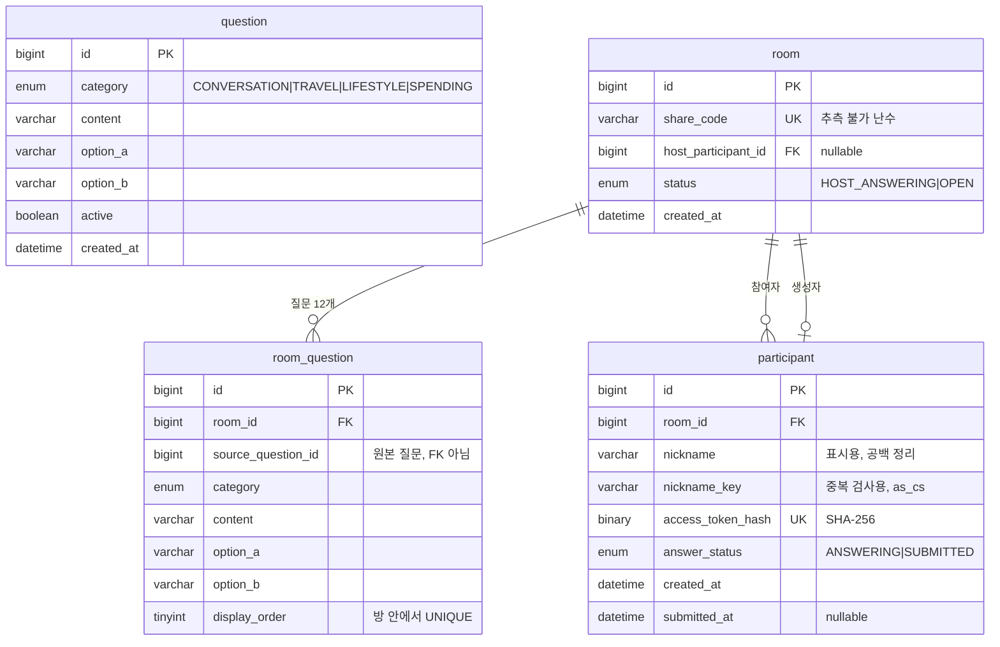

# ERD — 케미방 생성 (#1)

이슈 #1이 쓰는 4개 테이블. `answer`는 다음 이슈에서 추가.



## 결정 메모

### question ↔ room_question에는 FK를 두지 않음

방 생성 시점에 질문 내용을 값으로 복사한다.
질문 Pool의 내용이 변경되어도 기존 방의 질문은 유지되어야 하기 때문이다 (PRD 8장).

스냅샷은 값을 복사한 것으로 이미 달성된다. FK가 있어도 복사한 내용은 갱신되지 않는다.
FK를 두지 않는 이유는 따로 있다. 질문 Pool을 방과 독립적으로 정리하기 위해서다.
FK가 있으면 질문 하나를 지울 때 그 질문을 쓴 모든 방이 걸린다.

대신 `source_question_id`는 참조 무결성이 보장되지 않는 참고값이다.
가리키는 question 이 사라져도 검출되지 않으므로 통계·추적 용도로만 쓴다.

### room 과 participant 는 상호 참조

방장이 첫 참여자이므로 `room.host_participant_id → participant.id` 참조가 필요하다 (PRD 5장).
단, participant 생성 전에 room을 먼저 생성해야 하므로 `host_participant_id`는 nullable로 둔다.

단일 컬럼 FK만으로는 생성자가 **그 방의** participant라는 것이 보장되지 않는다.
`room 1.host_participant_id = participant 99` 이면서 `participant 99.room_id = room 2` 여도
각 FK는 유효하다. 복합 FK로 DB에서 강제한다.

```sql
UNIQUE (room_id, id)                                              -- participant
FOREIGN KEY (id, host_participant_id) → participant(room_id, id)  -- room
```

`participant.id`가 PK이므로 `(room_id, id)`의 유일성은 이미 보장된다.
이 UNIQUE는 중복 방지가 아니라 **복합 FK의 참조 대상 인덱스**를 제공하려고 둔다.

MySQL은 복합 FK에서 한 컬럼이라도 NULL이면 검사를 건너뛴다.
`host_participant_id`가 NULL인 상태로 방을 먼저 만드는 순서가 그대로 유지된다.
방 생성과 생성자 지정은 한 트랜잭션으로 묶는다.

### nickname 과 nickname_key 를 나눔

입력 `  Cafe  Latte  ` 를 저장하면 이렇게 된다.

| 컬럼 | 값 | 적용 규칙 | 용도 |
| --- | --- | --- | --- |
| `nickname` | `Cafe Latte` | trim, 연속 공백 1칸 | 화면 표시 |
| `nickname_key` | `cafe latte` | 위 + NFC, 소문자화 | 중복 검사 |

표시용도 공백은 정리한다. PRD 7장은 입력 원문 보존을 요구하지 않으며,
앞뒤 공백이 그대로 노출되면 화면이 어긋난다.

정규화는 전부 애플리케이션에서 수행한다. DB collation으로는 NFC 정규화와 공백 축소를
할 수 없어서, 규칙을 나눠 두면 어느 쪽이 적용됐는지 추적하기 어려워진다.

### UNIQUE (room_id, nickname_key)

애플리케이션의 중복 조회 → 저장만으로는 동시 요청을 막을 수 없다.
두 요청이 동시에 중복 조회를 통과한 뒤 각각 INSERT할 수 있기 때문이다.
최종 정합성은 `UNIQUE (room_id, nickname_key)` 제약으로 보장한다.

애플리케이션 사전 조회는 빠른 오류 응답을 위해 유지한다.
최종적으로 UNIQUE 제약 위반이 발생한 경우에도 `409 NICKNAME_DUPLICATED`로 변환한다.

### nickname_key 는 accent 를 구분한다

기본 collation `utf8mb4_0900_ai_ci`는 accent-insensitive라 `cafe` 와 `café` 를 같은 값으로 본다.
PRD 7장이 요구한 중복 판정 기준은 대소문자 통합까지이므로 accent는 구분해야 한다.

`nickname_key` 컬럼에만 `utf8mb4_0900_as_cs` 를 지정한다.
소문자화까지 애플리케이션이 끝낸 값이 들어오므로 DB는 있는 그대로 비교하면 되고,
정규화 규칙이 애플리케이션 한 곳에만 남는다.

대신 DB가 대소문자 차이를 더는 걸러주지 않는다. 정규화가 잘못되면 중복이 그대로 들어간다.
소문자화는 `toLowerCase(Locale.ROOT)` 로 한다. 인자 없이 부르면 시스템 로케일을 타는데,
터키어 로케일에서는 `I` 가 점 없는 `ı` 로 바뀌어 같은 닉네임이 서버마다 다르게 정규화된다.

### 참여자 토큰은 해시로 저장한다

`access_token`은 재접속 인증에 쓰는 자격증명이다. 평문으로 두면 DB 유출 시 그대로 악용된다.
원본은 발급 시 한 번만 쿠키로 내려주고 저장하지 않는다.
DB에는 SHA-256 해시를 `BINARY(32)`로 저장한다.

서버 기본 collation `utf8mb4_0900_ai_ci`에서는 대소문자만 다른 토큰이 같은 값으로 취급된다.
실제로 `aBcXyZ` 를 저장한 뒤 `ABCXYZ` 로 조회하면 매칭되고, INSERT 는 중복으로 거부된다.
`BINARY(32)`는 바이너리 비교라 이 문제가 발생하지 않는다.

토큰 원본은 128-bit 이상 난수를 URL-safe base64 로 인코딩한다 (PRD 17장).

### 상태와 시각은 함께 움직인다

`answer_status` 와 `submitted_at` 이 어긋나지 않도록 CHECK 로 묶는다.
`room.status = OPEN` 은 방장이 답변을 제출한 뒤에만 가능하다 (PRD 5장).
두 테이블을 함께 봐야 하는 조건이라 MySQL CHECK 로는 표현할 수 없다. 한 트랜잭션으로 묶는다.

```text
방장 답변 제출
  participant.answer_status = SUBMITTED
  participant.submitted_at  = now()
  room.status               = OPEN
```

### 제약

```sql
-- room
UNIQUE (share_code)
FOREIGN KEY (id, host_participant_id)
    REFERENCES participant(room_id, id)  ON DELETE RESTRICT

-- room_question
UNIQUE (room_id, display_order)
UNIQUE (room_id, source_question_id)     -- 한 방에 같은 질문이 두 번 들어가지 않음
CHECK  (display_order BETWEEN 1 AND 12)
FOREIGN KEY (room_id)
    REFERENCES room(id)                  ON DELETE CASCADE

-- participant
-- collation 은 nickname_key 컬럼 정의에 지정한다
--   nickname_key VARCHAR(12) CHARACTER SET utf8mb4 COLLATE utf8mb4_0900_as_cs NOT NULL
UNIQUE (room_id, nickname_key)
UNIQUE (room_id, id)                     -- room 복합 FK 의 참조 대상 인덱스
UNIQUE (access_token_hash)
CHECK  ((answer_status='SUBMITTED' AND submitted_at IS NOT NULL)
     OR (answer_status='ANSWERING' AND submitted_at IS NULL))
FOREIGN KEY (room_id)
    REFERENCES room(id)                  ON DELETE RESTRICT
```

`display_order` 범위는 CHECK 로 막을 수 있으나 **개수가 정확히 12개인지는 DB로 보장할 수 없다.**
방 생성 트랜잭션과 테스트에서 확인한다.

FK 컬럼용 인덱스는 따로 만들지 않는다.
`room_question(room_id, display_order)` 와 `participant(room_id, nickname_key)` 의
좌측 프리픽스가 `room_id` 이므로 InnoDB 가 이를 그대로 쓴다.

### DDL 작성 시 주의

room 과 participant 가 서로 참조하므로 `CREATE TABLE` 만으로는 순서를 잡을 수 없다.
마지막 FK 는 `ALTER TABLE` 로 추가한다.

```text
CREATE TABLE room          -- host FK 없이
CREATE TABLE participant   -- room_id FK 포함
ALTER  TABLE room ADD CONSTRAINT fk_room_host ...
```

삭제도 순서가 있다. `participant.room_id` 가 RESTRICT 라 방에 남은 참여자가 하나라도 있으면
room 을 지울 수 없다. MVP 에는 방 삭제 기능이 없지만 운영상 필요할 때는 이 순서를 따른다.

```text
room.host_participant_id = NULL
  →  해당 room 의 participant 전체 삭제
  →  room 삭제
```

`room_question` 은 CASCADE 라 room 삭제 시 함께 지워진다.
