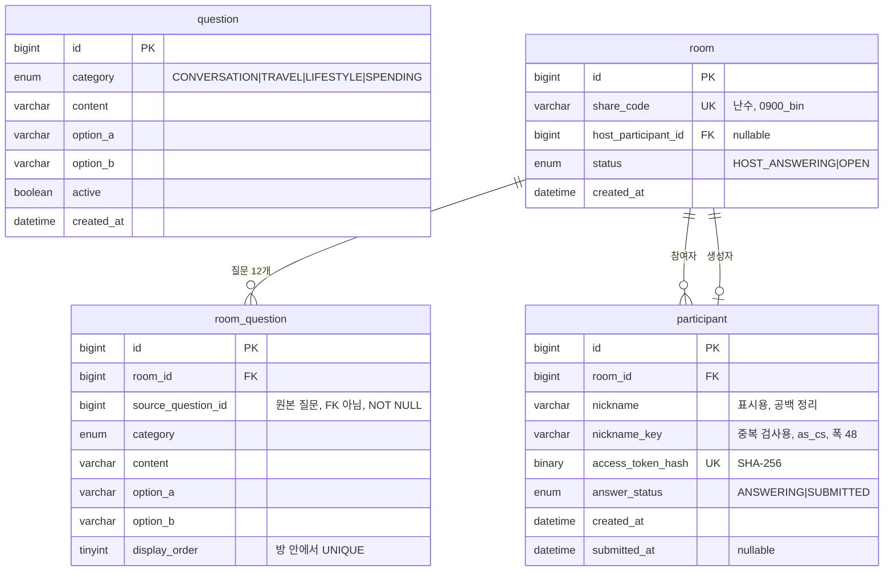

# Database

스키마 설계와 그 근거. **스키마의 실제 정의는 `database/init/01-schema.sql` 이 소유한다.**
JPA `ddl-auto` 는 `none` 이므로 Entity 를 고쳐도 스키마는 바뀌지 않는다.
스키마를 바꾸려면 SQL 파일을 고치고 볼륨을 지운 뒤 다시 띄워야 한다 (`database/README.md`).

이 문서와 실제 SQL 이 어긋나면 **SQL 이 현재 동작이고 이 문서가 의도다.**
어긋난 채로 한쪽만 고치면 안 된다. 불일치를 먼저 해소한다.

아래는 이슈 #1이 쓰는 4개 테이블. `answer`는 다음 이슈에서 추가.



## 결정 메모

### room_question 은 관계 테이블이 아니라 스냅샷이다

> **이 절은 임의 수정 금지 대상이다.**
> `room_question` 을 흔한 M:N 관계 테이블로 보고 `source_question_id` 에 FK 를 추가하지 마라.
> FK 부재는 누락이 아니라 결정이다. 바꾸려면 아래 근거를 먼저 반박해야 한다.

`room_question` 은 방 생성 시점의 `question` **값 복사본**이다. 복사 대상은 다음과 같다.

```text
question.id       →  room_question.source_question_id   원본 추적용, FK 아님
question.category →  room_question.category
question.content  →  room_question.content
question.option_a →  room_question.option_a
question.option_b →  room_question.option_b
```

원본 `question` 이 나중에 수정되거나 삭제되어도 이미 만들어진 방의 질문은 그대로여야 한다 (PRD 8장).

스냅샷 자체는 값을 복사한 것으로 이미 달성된다. FK가 있어도 복사한 내용은 갱신되지 않는다.
**FK를 두지 않는 이유는 따로 있다.** 질문 Pool을 방과 독립적으로 정리하기 위해서다.
FK가 있으면 질문 하나를 지울 때 그 질문을 쓴 모든 방이 걸린다.

대신 `source_question_id`는 참조 무결성이 보장되지 않는 참고값이다.
가리키는 question 이 사라져도 검출되지 않으므로 통계·추적 용도로만 쓴다.
**조회 시 `question` 과 조인하지 마라.** 방의 질문은 `room_question` 만 읽어서 완결되어야 한다.
조인하는 순간 스냅샷이 무의미해진다.

`source_question_id` 는 FK 는 아니지만 **`NOT NULL` 이다.** 아래 `UNIQUE (room_id, source_question_id)`
가 작동하려면 그래야 한다. MySQL 은 UNIQUE 인덱스에서 NULL 을 서로 다른 값으로 취급하므로,
nullable 이면 같은 방에 같은 질문이 두 번 들어가도 막지 못한다. nullable 로 되돌리지 마라.

### room 과 participant 는 상호 참조

방장이 첫 참여자이므로 `room.host_participant_id → participant.id` 참조가 필요하다 (PRD 5장).
단, participant 생성 전에 room을 먼저 생성해야 하므로 `host_participant_id`는 nullable로 둔다.

단일 컬럼 FK만으로는 생성자가 **그 방의** participant라는 것이 보장되지 않는다.
`room 1.host_participant_id = participant 99` 이면서 `participant 99.room_id = room 2` 여도
각 FK는 유효하다. 복합 FK로 DB에서 강제한다.

```sql
UNIQUE (room_id, id)                                              -- participant
FOREIGN KEY (id, host_participant_id) → participant(room_id, id)  -- room
```

`participant.id`가 PK이므로 `(room_id, id)`의 유일성은 이미 보장된다.
이 UNIQUE는 중복 방지가 아니라 **복합 FK의 참조 대상 인덱스**를 제공하려고 둔다.

MySQL은 복합 FK에서 한 컬럼이라도 NULL이면 검사를 건너뛴다.
`host_participant_id`가 NULL인 상태로 방을 먼저 만드는 순서가 그대로 유지된다.
방 생성과 생성자 지정은 한 트랜잭션으로 묶는다.

### nickname 과 nickname_key 를 나눔

입력 `  Cafe  Latte  ` 를 저장하면 이렇게 된다.

| 컬럼 | 값 | 적용 규칙 | 용도 |
| --- | --- | --- | --- |
| `nickname` | `Cafe Latte` | trim, 연속 공백 1칸 | 화면 표시 |
| `nickname_key` | `cafe latte` | 위 + NFC, 소문자화 | 중복 검사 |

표시용도 공백은 정리한다. PRD 7장은 입력 원문 보존을 요구하지 않으며,
앞뒤 공백이 그대로 노출되면 화면이 어긋난다.

정규화는 전부 애플리케이션에서 수행한다. DB collation으로는 NFC 정규화와 공백 축소를
할 수 없어서, 규칙을 나눠 두면 어느 쪽이 적용됐는지 추적하기 어려워진다.

### UNIQUE (room_id, nickname_key)

애플리케이션의 중복 조회 → 저장만으로는 동시 요청을 막을 수 없다.
두 요청이 동시에 중복 조회를 통과한 뒤 각각 INSERT할 수 있기 때문이다.
최종 정합성은 `UNIQUE (room_id, nickname_key)` 제약으로 보장한다.

애플리케이션 사전 조회는 빠른 오류 응답을 위해 유지한다.
최종적으로 UNIQUE 제약 위반이 발생한 경우에도 `409 NICKNAME_DUPLICATED`로 변환한다.

### nickname_key 는 accent 를 구분한다

기본 collation `utf8mb4_0900_ai_ci`는 accent-insensitive라 `cafe` 와 `café` 를 같은 값으로 본다.
PRD 7장이 요구한 중복 판정 기준은 대소문자 통합까지이므로 accent는 구분해야 한다.

`nickname_key` 컬럼에만 `utf8mb4_0900_as_cs` 를 지정한다.
소문자화까지 애플리케이션이 끝낸 값이 들어오므로 DB는 있는 그대로 비교하면 되고,
정규화 규칙이 애플리케이션 한 곳에만 남는다.

**`nickname_key` 의 폭은 `nickname` 보다 넓다 (48 vs 12).** 소문자화가 문자 수를 늘릴 수 있기 때문이다.
`U+0130 (İ)` 의 소문자 매핑은 `U+0069 U+0307` 두 코드포인트이고 NFC 로 재결합되지 않는다.
두 컬럼을 같은 폭으로 두면 12자 닉네임이 24자 키가 되어 저장이 실패한다 (`1406 Data too long`).
사용자에게 보이지 않는 내부 컬럼이므로 표시용 길이에 맞출 이유가 없다. 폭을 줄이지 마라.

대신 DB가 대소문자 차이를 더는 걸러주지 않는다. 정규화가 잘못되면 중복이 그대로 들어간다.
소문자화는 `toLowerCase(Locale.ROOT)` 로 한다. 인자 없이 부르면 시스템 로케일을 타는데,
터키어 로케일에서는 `I` 가 점 없는 `ı` 로 바뀌어 같은 닉네임이 서버마다 다르게 정규화된다.

### 참여자 토큰은 해시로 저장한다

`access_token`은 재접속 인증에 쓰는 자격증명이다. 평문으로 두면 DB 유출 시 그대로 악용된다.
원본은 발급 시 한 번만 쿠키로 내려주고 저장하지 않는다.
DB에는 SHA-256 해시를 `BINARY(32)`로 저장한다.

서버 기본 collation `utf8mb4_0900_ai_ci`에서는 대소문자만 다른 토큰이 같은 값으로 취급된다.
실제로 `aBcXyZ` 를 저장한 뒤 `ABCXYZ` 로 조회하면 매칭되고, INSERT 는 중복으로 거부된다.
`BINARY(32)`는 바이너리 비교라 이 문제가 발생하지 않는다.

토큰 원본은 128-bit 이상 난수를 URL-safe base64 로 인코딩한다 (PRD 17장).

`share_code` 도 같은 문제를 겪는다. 기본 collation 에서는 대소문자만 다른 코드가 중복으로
거부되고, 잘못된 대소문자 URL 로도 방에 접근된다. base64url 은 대소문자를 구분하므로
바이너리 비교가 필요하다.

**`ascii_bin` 이 아니라 `utf8mb4_0900_bin` 을 쓴다.** 처음에는 `ascii_bin` 이었으나 두 가지 문제가 있었다.

- `ascii_bin` 은 **PAD SPACE** 라 비교할 때 후행 공백을 무시한다. 공유 코드는 입력 문자열을
  그대로 비교해야 하는데, PAD SPACE 면 `abc` 와 `abc   ` 가 같은 방으로 조회되고
  UNIQUE 인덱스에서도 충돌해 "코드 = 방의 유일한 식별자" 전제가 깨진다.
  MySQL 8.0 이상에서 NO PAD 인 문자 collation 은 `utf8mb4_0900_*` 계열뿐이다.
  charset 이 `binary` 인 `binary` collation 도 NO PAD 이지만 문자 비교용이 아니다
- 커넥션은 utf8mb4 인데 컬럼이 ascii 면, 비ASCII 입력으로 조회할 때 0건이 아니라 **예외**가 난다
  (`1267 Illegal mix of collations`, `3988 Conversion impossible`).
  인증 없이 아무나 던질 수 있는 경로에서 404 가 아니라 500 이 나온다

`ascii` 로 되돌리지 마라. 저장 공간을 아끼려는 이유라면 이득보다 손해가 크다.

### 상태와 시각은 함께 움직인다

`answer_status` 와 `submitted_at` 이 어긋나지 않도록 CHECK 로 묶는다.
`room.status = OPEN` 은 방장이 답변을 제출한 뒤에만 가능하다 (PRD 5장).
두 테이블을 함께 봐야 하는 조건이라 MySQL CHECK 로는 표현할 수 없다. 한 트랜잭션으로 묶는다.

```text
방장 답변 제출
  participant.answer_status = SUBMITTED
  participant.submitted_at  = now()
  room.status               = OPEN
```

### 제약

```sql
-- room
UNIQUE (share_code)
FOREIGN KEY (id, host_participant_id)
    REFERENCES participant(room_id, id)  ON DELETE RESTRICT

-- room_question
UNIQUE (room_id, display_order)
UNIQUE (room_id, source_question_id)     -- 한 방에 같은 질문이 두 번 들어가지 않음
CHECK  (display_order BETWEEN 1 AND 12)
FOREIGN KEY (room_id)
    REFERENCES room(id)                  ON DELETE CASCADE

-- participant
-- collation 은 nickname_key 컬럼 정의에 지정한다
--   nickname_key VARCHAR(48) CHARACTER SET utf8mb4 COLLATE utf8mb4_0900_as_cs NOT NULL
UNIQUE (room_id, nickname_key)
UNIQUE (room_id, id)                     -- room 복합 FK 의 참조 대상 인덱스
UNIQUE (access_token_hash)
CHECK  ((answer_status='SUBMITTED' AND submitted_at IS NOT NULL)
     OR (answer_status='ANSWERING' AND submitted_at IS NULL))
FOREIGN KEY (room_id)
    REFERENCES room(id)                  ON DELETE RESTRICT
```

`display_order` 범위는 CHECK 로 막을 수 있으나 **개수가 정확히 12개인지는 DB로 보장할 수 없다.**
방 생성 트랜잭션과 테스트에서 확인한다.

FK 컬럼용 인덱스는 따로 만들지 않는다.
`room_question(room_id, display_order)` 와 `participant(room_id, nickname_key)` 의
좌측 프리픽스가 `room_id` 이므로 InnoDB 가 이를 그대로 쓴다.

### DDL 작성 시 주의

room 과 participant 가 서로 참조하므로 `CREATE TABLE` 만으로는 순서를 잡을 수 없다.
마지막 FK 는 `ALTER TABLE` 로 추가한다.

```text
CREATE TABLE room          -- host FK 없이
CREATE TABLE participant   -- room_id FK 포함
ALTER  TABLE room ADD CONSTRAINT fk_room_host ...
```

삭제도 순서가 있다. `participant.room_id` 가 RESTRICT 라 방에 남은 참여자가 하나라도 있으면
room 을 지울 수 없다. MVP 에는 방 삭제 기능이 없지만 운영상 필요할 때는 이 순서를 따른다.

```text
room.host_participant_id = NULL
  →  해당 room 의 participant 전체 삭제
  →  room 삭제
```

`room_question` 은 CASCADE 라 room 삭제 시 함께 지워진다.

## 제약이 무력화되던 곳 (수정 완료)

아래 4건은 실제 MySQL 8.4 에 스키마를 적재해 재현했고, 수정 후 재현되지 않음을 다시 확인했다.
**네 건 모두 "제약을 선언했는데 특정 값에서 조용히 통과되는"** 형태였다.
이 기록은 같은 실수로 되돌아가는 것을 막기 위한 것이다.

| 무엇이 무력화됐나 | 어떤 값에서 | 어떻게 고쳤나 |
| --- | --- | --- |
| `share_code` 정확 비교 | 후행 공백 (`ascii_bin` 은 PAD SPACE) | `utf8mb4_0900_bin` (NO PAD) |
| `share_code` 조회 | 비ASCII 입력 → 0건이 아니라 예외 | 컬럼 charset 을 커넥션과 맞춤 |
| `nickname_key` 길이 | 소문자화로 12자 → 24자 | 폭을 48 로 |
| `UNIQUE (room_id, source_question_id)` | `NULL` (MySQL 은 NULL 을 중복으로 안 봄) | `NOT NULL` |

각 항목의 상세 근거는 위 결정 메모의 해당 절에 있다.

**교훈**: 제약이 존재한다는 것과 그 제약이 모든 입력에 대해 작동한다는 것은 다르다.
새 제약을 추가할 때 그것을 무력화하는 값(NULL, 공백, 대소문자, 정규화 결과)을 직접 대입해 보라.
