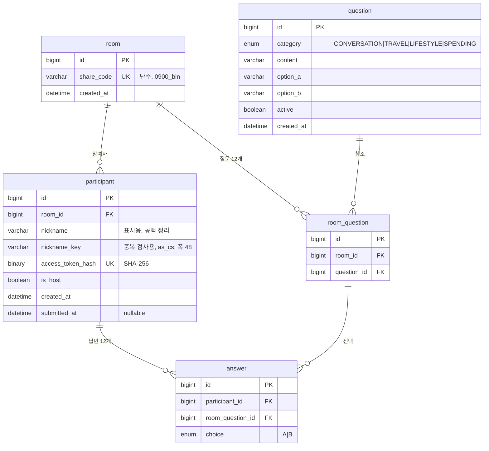

# Database

스키마 설계와 그 근거. **스키마의 실제 정의는 `database/init/01-schema.sql` 이 소유합니다.**
JPA `ddl-auto` 는 `none` 이므로 Entity 를 고쳐도 스키마는 바뀌지 않습니다.
스키마를 바꾸려면 SQL 파일을 고치고 볼륨을 지운 뒤 다시 띄워야 합니다 (`database/README.md`).

이 문서와 실제 SQL 이 어긋나면 **SQL 이 현재 동작이고 이 문서가 의도입니다.**
어긋난 채로 한쪽만 고치면 안 됩니다. 불일치를 먼저 해소합니다.

2026-08-27 에 ERD 를 다시 설계했습니다. 컬럼 여덟 개가 사라졌고 질문 스냅샷이 값 복사에서
참조로 바뀌었습니다. **결정마다의 근거는 아래 "결정 메모" 절에 하나씩 적어 두었습니다.**

**옛 스키마는 이 저장소의 이력에서 도달할 수 없습니다.** 재설계 전 커밋을 지우고 다시 쌓았기
때문입니다. 로컬에 백업 브랜치가 남아 있는 경우에만 볼 수 있습니다.

```bash
git show c02febe:database/init/01-schema.sql   # backup/before-reset-20260828 에서만 도달한다
```

**`HEAD` 로 조회하지 마십시오.** 같은 경로에 새 스키마가 있어서 명령은 성공하지만
재설계 전 내용이 아니라 지금 내용을 보여줍니다. 두 스키마가 같다고 오해하게 됩니다.



## 이 스키마를 읽기 전에

**컬럼이 적은 것은 빠뜨린 것이 아닙니다.** 옛 스키마에 있던 컬럼 여덟 개를 의도적으로 없앴습니다.
`room_question.source_question_id` 는 이 수에 넣지 않았습니다. 없앤 것이 아니라
`question_id` 로 이름이 바뀌었고 FK 도 함께 생겼습니다.

| 없앤 것 | 지금은 어떻게 아는가 |
| --- | --- |
| `room.status` | 방장의 `submitted_at` 이 있으면 `OPEN` 입니다 |
| `room.host_participant_id` | `participant.is_host` 가 `TRUE` 인 행이 방장입니다 |
| `participant.answer_status` | `submitted_at` 이 있으면 `SUBMITTED` 입니다 |
| `room_question` 의 `category`, `content`, `option_a`, `option_b` | `question` 을 참조해서 읽습니다 |
| `room_question.display_order` | 표시 순서는 `id` 오름차순입니다 |

**제약도 옛 스키마보다 적습니다.** 앱이 확실히 보장할 수 있는 것은 앱에 맡겼습니다.
무엇을 어디서 지키는지는 아래 "DB 가 강제하지 않는 것" 절에 있습니다.

## 결정 메모

### 질문은 불변입니다

> **이 절은 임의 수정 금지 대상입니다.**
> `question` 의 `category`, `content`, `option_a`, `option_b` 를 UPDATE 하는 코드를 만들지 마십시오.
> 이 전제가 깨지면 스키마 전체가 의미를 잃습니다.

`room_question` 은 `question` 을 **참조만 합니다.** 문구를 복사하지 않습니다.

```text
question       5   "여행 갈 때 계획파? 즉흥파?"
room_question  7   room_id=1  question_id=5
```

PRD 8장은 이미 만들어진 방의 질문과 결과가 바뀌지 않을 것을 요구합니다.
참조만 해도 그 요구가 지켜지는 이유는 **원본이 바뀌지 않기 때문**입니다.

문구를 고쳐야 하면 새 행을 넣고 옛 행을 내립니다.

```text
question  5  "여행 갈 때 계획파? 즉흥파?"   active=FALSE   옛 문구. 지우지 않는다
question  9  "여행 갈 때 뭘 먼저 정해?"      active=TRUE    새 문구는 새 행
```

옛 방들은 계속 5번을 참조하므로 그때 본 문구를 그대로 보여줍니다. 새로 만들어지는 방만 9번을 씁니다.

#### 전제가 깨지면 무슨 일이 생기나

누군가 `question` 의 문구를 UPDATE 하면 **이미 답변이 진행 중인 방의 질문이 바뀝니다.**

```text
14:00  지은이 답한다     "여행 갈 때 계획파? 즉흥파?"  →  A
15:00  운영자가 문구를 고친다
16:00  민수가 답한다     "여행 갈 때 뭘 먼저 정해?"    →  A
```

두 사람이 서로 다른 질문에 답했는데 점수 계산은 `choice` 만 봅니다.
**둘 다 A 이므로 일치로 셉니다.** 오류도 나지 않고 화면도 멀쩡합니다.

이 서비스의 전제가 "같은 질문에 각자 답하고 비교합니다" 인데 그 전제가 조용히 깨집니다.

#### 왜 DB 로 막지 않았나

두 가지를 검토하고 둘 다 쓰지 않기로 했습니다.

| 수단 | 되는가 | 왜 안 썼나 |
| --- | --- | --- |
| 트리거 (`BEFORE UPDATE` + `SIGNAL`) | 됩니다. 실측했습니다 | root 까지 막습니다. 운영상 정말 고쳐야 할 때 트리거를 떼었다 붙여야 합니다 |
| 컬럼 단위 `GRANT UPDATE (active)` | 됩니다. 실측했습니다 | `REVOKE ALL ON db.*` 를 먼저 해야 하고, 그 뒤로는 테이블을 추가할 때마다 `GRANT` 를 함께 관리해야 합니다 |

**막으려던 것은 운영자가 콘솔에서 하는 실수인데, 그 일이 일어날 빈도가 낮습니다.**
운영 콘솔 접근자가 한 명이고 그 사람이 이 규칙을 압니다. 항상 드는 관리 부담이
가끔 일어날 실수를 막는 값보다 크다고 판단했습니다.

컬럼 권한을 쓰기로 마음을 바꾼다면 **Docker 엔트리포인트가 `MYSQL_USER` 에게
DB 전체 ALL 을 줍니다**는 것을 먼저 알아야 합니다. 회수하지 않으면 컬럼 권한을 걸어도
넓은 권한이 이겨서 그대로 통과합니다. 실측으로 확인했습니다.

#### 조인해도 됩니다

옛 스키마는 값을 복사해 두고 "`question` 과 조인하지 마라" 는 규칙으로 스냅샷을 지켰습니다.
지금은 반대입니다. **질문이 불변이므로 조인해도 옛 방에 새 문구가 붙지 않습니다.**

```sql
SELECT q.category, q.content, q.option_a, q.option_b
FROM room_question rq
JOIN question q ON q.id = rq.question_id
WHERE rq.room_id = ?
ORDER BY rq.id
```

### 표시 순서는 `id` 오름차순입니다

`room_question` 에 순서 컬럼을 두지 않습니다. `id` 가 AUTO_INCREMENT 라 삽입 순서를 담습니다.

방을 만들 때 질문 12개를 **무작위로 섞어서** INSERT 합니다. 그래서 방마다 순서가 다르고,
한 방 안에서는 모든 참여자가 같은 순서로 봅니다 (PRD 7장, FR-03).
카테고리를 묶지 않으므로 대화 질문 다음에 소비 질문이 나올 수 있습니다.

**조회할 때 `ORDER BY rq.id` 를 빠뜨리면 순서가 보장되지 않습니다.**
SQL 은 `ORDER BY` 없는 결과의 순서를 약속하지 않습니다. 지금까지 삽입 순서대로 나왔다면
그것은 우연입니다. 스키마가 이 규칙을 강제하지 못하므로 조회하는 쪽이 지켜야 합니다.

컬럼을 없앤 대가로 **`id` 가 식별자이면서 순서이기도 합니다.** 그 사실이 스키마에
선언돼 있지 않다는 것이 이 선택의 약점입니다. 화면에 "3/12" 를 보여줄 때도
방 안에서 몇 번째인지 앱이 세야 합니다.

### 상태를 컬럼으로 두지 않습니다

방 상태와 답변 상태를 저장하지 않고 시각 하나로 판단합니다.

```text
방이 OPEN 인가        방장(is_host = TRUE)의 submitted_at IS NOT NULL
참여자가 제출했는가     그 참여자의 submitted_at IS NOT NULL
```

API 응답에는 `HOST_ANSWERING` / `OPEN`, `ANSWERING` / `SUBMITTED` 를 그대로 담습니다.
프론트는 응답만 보므로 저장 방식의 차이를 모릅니다 (PRD 7장, 20장).

옛 스키마는 `submitted_at` 과 `answer_status` 를 함께 두고 CHECK 로 묶었습니다.
**두 컬럼을 묶는 제약이 필요했다는 것 자체가 둘이 같은 사실을 말하고 있다는 신호였습니다.**
컬럼을 하나로 줄이니 어긋날 방법이 없어졌고 CHECK 도 필요 없어졌습니다.

`room.status` 는 더 나빴습니다. 다른 테이블에 있어서 CHECK 로 묶지도 못하고
트랜잭션으로만 맞추고 있었습니다. 한쪽만 바뀌면 방장은 답을 냈는데 친구는
"방장이 준비 중" 화면에서 막힙니다.

### 방장은 참여자의 속성입니다

방장도 참여자 중 한 명이므로 `participant.is_host` 로 표시합니다 (PRD 5장).

옛 스키마는 `room.host_participant_id` 로 방 쪽에 적었고, 그 대가가 넷이었습니다.

```text
NULL 허용 컬럼       참여자보다 방을 먼저 만들어야 해서 순간적으로 비어 있다
순환 참조            room → participant → room
복합 FK             방장이 그 방 사람인지 보장하려면 한 컬럼으로는 부족했다
ALTER TABLE          순환 때문에 CREATE TABLE 만으로 순서를 잡을 수 없었다
```

`is_host` 는 참여자 행 안에 있고 그 행에는 `room_id` 도 함께 있습니다.
**한 행 안의 두 값은 어긋날 수 없으므로 복합 FK 가 필요 없습니다.**

### nickname 과 nickname_key 를 나눔

입력 `  Cafe  Latte  ` 를 저장하면 이렇게 됩니다.

| 컬럼 | 값 | 적용 규칙 | 용도 |
| --- | --- | --- | --- |
| `nickname` | `Cafe Latte` | trim, 연속 공백 1칸 | 화면 표시 |
| `nickname_key` | `cafelatte` | 위 + NFC, 공백 전부 제거, 소문자화 | 중복 검사 |

표시용도 공백은 정리합니다. PRD 7장은 입력 원문 보존을 요구하지 않으며,
앞뒤 공백이 그대로 노출되면 화면이 어긋납니다.

**공백을 지우는 것은 키뿐입니다.** 표시값에는 내부 공백이 남습니다. PRD 7장이 두 규칙을
나눠 뒀습니다. `지 은` 으로 입력한 사람은 `지 은` 으로 보이고, 중복 판정에서만 `지은` 과 같아집니다.

정규화는 전부 애플리케이션에서 수행합니다. DB collation 으로는 NFC 정규화와 공백 축소를
할 수 없어서, 규칙을 나눠 두면 어느 쪽이 적용됐는지 추적하기 어려워집니다.

`nickname_key` 는 `nickname` 에서 계산되는 값이므로 **3NF 를 어기는 것이 맞습니다.**
그래도 컬럼으로 두는 이유는 `UNIQUE (room_id, nickname_key)` 를 걸어야 하기 때문입니다.
함수 인덱스로 대신할 수 없습니다. 세 단계 규칙 중 NFC 정규화를 SQL 함수로 표현할 방법이 없습니다.

### UNIQUE (room_id, nickname_key)

애플리케이션의 중복 조회 → 저장만으로는 동시 요청을 막을 수 없습니다.
두 요청이 동시에 중복 조회를 통과한 뒤 각각 INSERT 할 수 있기 때문입니다.
최종 정합성은 `UNIQUE (room_id, nickname_key)` 제약으로 보장합니다.

애플리케이션 사전 조회는 빠른 오류 응답을 위해 유지합니다.
최종적으로 UNIQUE 제약 위반이 발생한 경우에도 `409 NICKNAME_DUPLICATED` 로 변환합니다.

### nickname_key 는 accent 를 구분합니다

기본 collation `utf8mb4_0900_ai_ci` 는 accent-insensitive 라 `cafe` 와 `café` 를 같은 값으로 봅니다.
PRD 7장이 요구한 중복 판정 기준은 대소문자 통합과 공백 제거까지이므로 accent 는 구분해야 합니다.

`nickname_key` 컬럼에만 `utf8mb4_0900_as_cs` 를 지정합니다.
소문자화까지 애플리케이션이 끝낸 값이 들어오므로 DB 는 있는 그대로 비교하면 되고,
정규화 규칙이 애플리케이션 한 곳에만 남습니다.

**`nickname_key` 의 폭은 `nickname` 보다 넓습니다 (48 vs 12).** 정규화가 문자 수를 늘리는
경로가 둘 있고, 둘 다 12자 입력에서 실측으로 확인했습니다.

| 경로 | 예 | 배수 |
| --- | --- | --- |
| 소문자화 | `U+0130 (İ)` → `U+0069 U+0307`. NFC 로 재결합되지 않습니다 | 2배 |
| NFC 합성 제외 | `U+FB2C` 같은 히브리 표현형은 3 코드포인트로 분해됩니다 | 3배 |

**12자 닉네임의 키가 최대 36자가 됩니다.** 폭이 좁으면 `1406 Data too long` 으로 저장이 실패합니다.
48 은 그 상한에 여유를 둔 값입니다. **36 아래로 줄이지 마십시오.**
사용자에게 보이지 않는 내부 컬럼이므로 표시용 길이에 맞출 이유가 없습니다.

대신 DB 가 대소문자 차이를 더는 걸러주지 않습니다. 정규화가 잘못되면 중복이 그대로 들어갑니다.
소문자화는 `toLowerCase(Locale.ROOT)` 로 합니다. 인자 없이 부르면 시스템 로케일을 타는데,
터키어 로케일에서는 `I` 가 점 없는 `ı` 로 바뀌어 같은 닉네임이 서버마다 다르게 정규화됩니다.

### 참여자 토큰은 해시로 저장합니다

`access_token` 은 재접속 인증에 쓰는 자격증명입니다. 평문으로 두면 DB 유출 시 그대로 악용됩니다.
원본은 발급 시 한 번만 쿠키로 내려주고 저장하지 않습니다.
DB 에는 SHA-256 해시를 `BINARY(32)` 로 저장합니다.

서버 기본 collation `utf8mb4_0900_ai_ci` 에서는 대소문자만 다른 토큰이 같은 값으로 취급됩니다.
실제로 `aBcXyZ` 를 저장한 뒤 `ABCXYZ` 로 조회하면 매칭되고, INSERT 는 중복으로 거부됩니다.
`BINARY(32)` 는 바이너리 비교라 이 문제가 발생하지 않습니다.

토큰 원본은 128-bit 이상 난수를 URL-safe base64 로 인코딩합니다 (PRD 17장).

**`UNIQUE (access_token_hash)` 의 근거는 닉네임 쪽과 다릅니다.** 앱은 토큰 중복을
조회하지 않고 난수를 그대로 쓰므로, 이 제약이 막는 것은 동시 요청 경합이 아니라 난수 충돌입니다.
토큰으로 참여자를 찾는 조회의 인덱스이기도 합니다.

### share_code 의 collation

`share_code` 도 대소문자 문제를 겪습니다. 기본 collation 에서는 대소문자만 다른 코드가
중복으로 거부되고, 잘못된 대소문자 URL 로도 방에 접근됩니다.
base64url 은 대소문자를 구분하므로 바이너리 비교가 필요합니다.

**`ascii_bin` 이 아니라 `utf8mb4_0900_bin` 을 씁니다.** 처음에는 `ascii_bin` 이었으나 두 가지 문제가 있었습니다.

- `ascii_bin` 은 **PAD SPACE** 라 비교할 때 후행 공백을 무시합니다. 공유 코드는 입력 문자열을
  그대로 비교해야 하는데, PAD SPACE 면 `abc` 와 `abc   ` 가 같은 방으로 조회됩니다.
  MySQL 8.0 이상에서 NO PAD 인 문자 collation 은 `utf8mb4_0900_*` 계열뿐입니다.
  charset 이 `binary` 인 `binary` collation 도 NO PAD 이지만 문자 비교용이 아닙니다
- 커넥션은 utf8mb4 인데 컬럼이 ascii 면, 비ASCII 입력으로 조회할 때 0건이 아니라 **예외**가 납니다
  (`1267 Illegal mix of collations`, `3988 Conversion impossible`).
  인증 없이 아무나 던질 수 있는 경로에서 404 가 아니라 500 이 나옵니다

`ascii` 로 되돌리지 마십시오. 저장 공간을 아끼려는 이유라면 이득보다 손해가 큽니다.

### submitted_at 은 NOW(6) 로 채웁니다

`created_at` 세 개는 DB 가 `DEFAULT CURRENT_TIMESTAMP(6)` 로 만듭니다.
`submitted_at` 은 제출 시점에 UPDATE 하는 값이라 DEFAULT 를 쓸 수 없습니다.

**여기서 앱이 `LocalDateTime.now()` 를 쓰면 두 시각의 기준이 달라집니다.**
`DATETIME` 은 시간대를 담지 않으므로 JVM 이 UTC 인 컨테이너에서는 `submitted_at` 이
`created_at` 보다 9시간 이르게 저장되고 **DB 는 아무 오류도 내지 않습니다.**
위키 `API-규약` 이 응답 시각을 `Asia/Seoul` 로 정해 두었습니다.

## 제약

```sql
-- question
-- collation 은 content 컬럼 정의에 지정한다. 무엇이 중복으로 걸리는지가 여기 달렸다
--   content VARCHAR(200) CHARACTER SET utf8mb4 COLLATE utf8mb4_0900_ai_ci NOT NULL
UNIQUE (category, content)               -- 시드 재적용을 1062 로 멈춘다. 아래 절 참고

-- room
UNIQUE (share_code)

-- room_question
-- 같은 question 행을 두 번 넣는 것만 막는다. 글자가 같아도 id 가 다르면 통과하므로
-- "같은 질문이 두 번 보이지 않는다" 의 근거는 위 question UNIQUE 와 함께여야 성립한다.
UNIQUE (room_id, question_id)
FOREIGN KEY (room_id)     REFERENCES room(id)      ON DELETE CASCADE
FOREIGN KEY (question_id) REFERENCES question(id)  ON DELETE RESTRICT

-- participant
-- collation 은 nickname_key 컬럼 정의에 지정한다
--   nickname_key VARCHAR(48) CHARACTER SET utf8mb4 COLLATE utf8mb4_0900_as_cs NOT NULL
UNIQUE (room_id, nickname_key)
UNIQUE (access_token_hash)
FOREIGN KEY (room_id) REFERENCES room(id)          ON DELETE RESTRICT

-- answer
UNIQUE (participant_id, room_question_id) -- 한 사람이 한 질문에 한 번만
FOREIGN KEY (participant_id)   REFERENCES participant(id)   ON DELETE CASCADE
FOREIGN KEY (room_question_id) REFERENCES room_question(id) ON DELETE CASCADE
```

FK 컬럼용 인덱스를 따로 만들지 않아도 되는 곳이 있습니다.
`participant(room_id, nickname_key)` 와 `room_question(room_id, question_id)` 의
좌측 프리픽스가 `room_id` 이므로 InnoDB 가 이를 그대로 씁니다.
`room_question.question_id` 와 `answer.room_question_id` 는 좌측 프리픽스가 아니라
MySQL 이 인덱스를 자동 생성합니다.

## DB 가 강제하지 않는 것

**아래는 빠뜨린 것이 아니라 앱에 맡긴 것입니다.** 다시 넣기 전에 이 절을 읽으십시오.

| 규칙 | 어디서 지키나 | 왜 |
| --- | --- | --- |
| 방마다 방장은 한 명 | 방 생성 트랜잭션 | `is_host = TRUE` 를 쓰는 곳이 한 군데뿐입니다. 링크로 들어오는 참여자는 항상 `FALSE` 입니다 |
| 질문은 정확히 12개 | 방 생성 트랜잭션과 테스트 | 개수는 DB 로 셀 수 없습니다 |
| 참여자와 질문이 같은 방 | 답변 저장 로직 | `answer` 에 `room_id` 를 넣고 복합 FK 를 걸면 DB 로 되지만 컬럼이 늡니다 |
| `question` 내용 불변 | 앱과 운영 규칙 | 위 "왜 DB 로 막지 않았나" 참고 |
| 표시 순서 | 조회 시 `ORDER BY rq.id` | 순서 컬럼이 없습니다 |

기준은 하나입니다. **두 요청 사이에 끼어들 수 있는가.**
조회하고 저장하는 사이에 다른 요청이 들어올 수 있으면 앱은 원리적으로 막지 못하므로 DB 가 잡습니다.
코드 한 곳에서 보장되는 것은 앱에 맡깁니다.

남은 UNIQUE 넷 중 셋이 앞의 경우입니다. 닉네임 중복, 공유 코드 중복, 답변 중복 제출입니다.

## 방을 지우는 순서

`participant.room_id` 가 RESTRICT 라 `DELETE FROM room` 은 `1451` 로 거부됩니다.
`room_question` 의 CASCADE 와 방향이 다른 것은 의도입니다. 파생 데이터는 따라 지워도 되지만
사람이 남긴 것은 실수로 지워지면 안 됩니다.

```text
1) 그 방의 participant 를 지운다   answer 는 CASCADE 로 함께 지워진다
2) room 을 지운다                  room_question 은 CASCADE 로 함께 지워진다
```

MVP 에는 방 삭제 기능이 없습니다 (PRD 7장). 운영상 필요할 때 이 순서를 따릅니다.
실제로 넣어 확인했습니다. 참여자 1명, 질문 12개, 답변 12건이 위 순서로 전부 정리됩니다.

`question` 은 어느 방이든 쓰고 있으면 지워지지 않습니다 (`1451`).
질문을 내리려면 삭제가 아니라 `active = FALSE` 로 합니다.

## 정규화 수준

| 단계 | 판정 |
| --- | --- |
| 1NF | `question.option_a` / `option_b` 가 반복 그룹입니다. 개수가 2개로 고정이라 그대로 둡니다 |
| 2NF | 만족. 모든 PK 가 단일 컬럼이라 부분 종속이 생기지 않습니다 |
| 3NF | `participant.nickname_key` 하나가 위반입니다. 위 "nickname 과 nickname_key 를 나눔" 참고 |

재설계로 3NF 위반 세 건을 없앴습니다.

```text
room_question 의 값 복사   source_question_id → content, option_a, option_b
participant.answer_status  submitted_at → answer_status
room.status                방장의 제출 여부에서 파생
```

## 제약이 무력화되던 곳 (수정 완료)

아래는 실제 MySQL 8.4 에 스키마를 적재해 재현했고, 수정 후 재현되지 않음을 다시 확인했습니다.
**모두 "제약을 선언했는데 특정 값에서 조용히 통과되는"** 형태였습니다.
이 기록은 같은 실수로 되돌아가는 것을 막기 위한 것입니다.

| 무엇이 무력화됐나 | 어떤 값에서 | 어떻게 고쳤나 |
| --- | --- | --- |
| `share_code` 정확 비교 | 후행 공백 (`ascii_bin` 은 PAD SPACE) | `utf8mb4_0900_bin` (NO PAD) |
| `share_code` 조회 | 비ASCII 입력 → 0건이 아니라 예외 | 컬럼 charset 을 커넥션과 맞춤 |
| `nickname_key` 길이 | 소문자화로 12자 → 24자, 히브리 표현형으로 → 36자 | 폭을 48 로 |
| 한 방의 문항 중복 방지 | 시드를 두 번 적용해 같은 글자가 다른 `id` 를 얻을 때 | `question` 에 `UNIQUE (category, content)` |

### 한 방에 같은 질문이 두 번 나올 수 있었습니다

`room_question` 의 `UNIQUE (room_id, question_id)` 는 **`id` 로 비교합니다.**
`question` 에 글자 기준 제약이 없어서, 시드를 두 번 적용하면 같은 문구가 새 `id` 로
120행 더 들어가고 그 UNIQUE 는 조용히 통과합니다. 방을 만들 때 두 행이 함께 뽑히면
참여자에게 똑같은 질문이 두 번 보이고, 그 카테고리 점수가 서로 다른 3문항이 아니라
같은 문항 두 개로 계산됩니다.

MySQL 8.4 에서 재현하고 수정 후 다시 확인했습니다.

```text
수정 전   시드 재적용 → 조용히 통과. question 240행
수정 후   시드 재적용 → ERROR 1062 ... for key 'question.uk_question_category_content'
                       행수 120 유지
```

**무엇이 막히는지는 `content` 의 collation 이 정합니다.** 컬럼에
`utf8mb4_0900_ai_ci` 를 명시했으므로 서버 설정과 무관하게 아래가 동작입니다.
대입해 확인한 결과입니다.

| 대입한 값 | 결과 |
| --- | --- |
| 같은 카테고리, 똑같은 글자 | 막힘 (`1062`) |
| 같은 카테고리, 대소문자만 다른 값 | 막힘. `ai_ci` 는 case-insensitive 입니다 |
| 같은 카테고리, accent 만 다른 값 | 막힘. `ai_ci` 는 accent-insensitive 입니다 |
| 같은 카테고리, 후행 공백을 붙인 값 | 통과. `utf8mb4_0900_*` 계열은 NO PAD 입니다 |
| 다른 카테고리, 똑같은 글자 | 통과. 의도한 동작입니다 |

**영문 문항을 추가할 때 주의하십시오.** 대소문자만 다른 두 문항을 같은 카테고리에 넣으면
시드가 `1062` 로 멈추고, 엔트리포인트가 `set -e` 라 **컨테이너가 기동하지 않습니다.**
지금 시드는 한글 120문항이라 걸리는 쌍이 없습니다.

**`content` 의 collation 을 지우고 서버 기본값에 맡기지 마십시오.** `NO PAD` 는
8.0 이상 전체의 성질이 아닙니다. `utf8mb4_general_ci` 와 `utf8mb4_unicode_ci` 는
`PAD SPACE` 입니다. 그런 서버에 적재하면 위 표의 후행 공백 줄이 뒤집힙니다.
`share_code` 와 `nickname_key` 를 명시한 것과 같은 이유입니다.

문구가 비슷한 질문을 걸러내는 장치가 아닙니다. 그것은 시드를 쓰는 사람이 봅니다.

재설계 전에는 `UNIQUE (room_id, source_question_id)` 가 `NULL` 로 무력화되는 항목이
하나 더 있었습니다. **그 컬럼 자체가 사라져 해당하지 않습니다.**

**교훈**: 제약이 존재한다는 것과 그 제약이 모든 입력에 대해 작동한다는 것은 다릅니다.
새 제약을 추가할 때 그것을 무력화하는 값(NULL, 공백, 대소문자, 정규화 결과)을 직접 대입해 보십시오.
